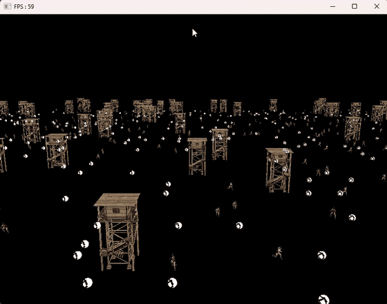
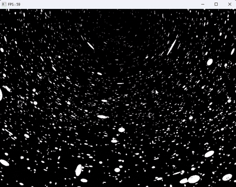
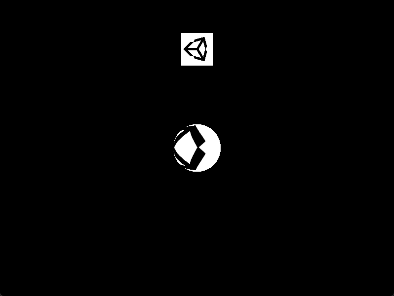
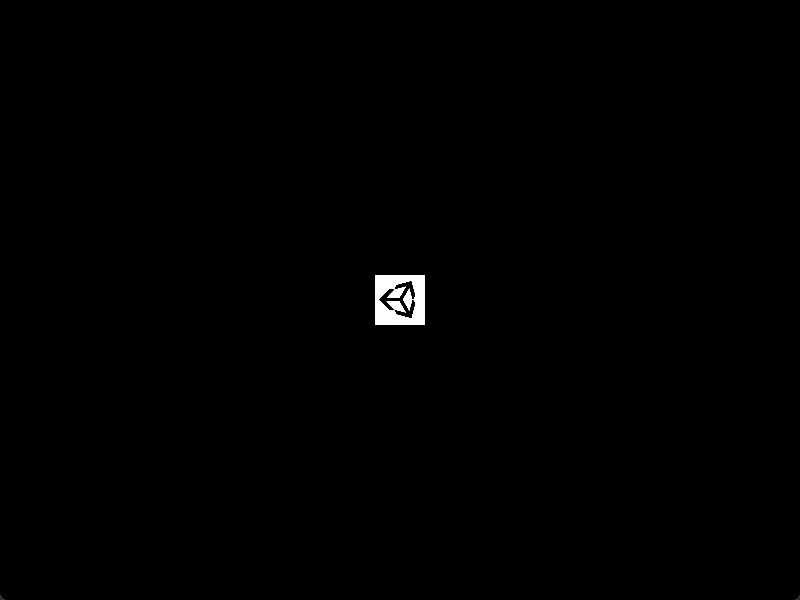
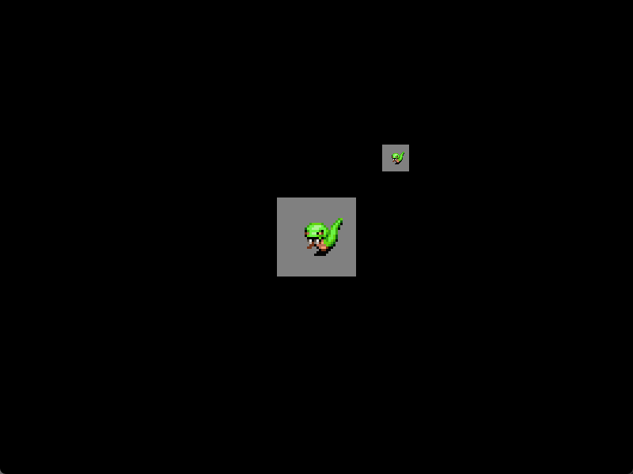

# DirectX 11 Study — 상용 엔진이 감춰 주는 계층을 직접 만들어 보기


-5C2D91?logo=visualstudio&logoColor=white)


> **인프런 DirectX 11 강의를 기반으로 로우 레벨 렌더링 과정과 엔진 내부 로직을 공부한 저장소입니다.**
> 정점 버퍼를 GPU에 올리고, 상수 버퍼로 행렬을 넘기고, 셰이더 패스를 골라 드로우콜을 부르기까지 —
> 상용 엔진이 대신 해 주는 일을 직접 짜 보며 확인했습니다.
> 이해한 내용은 **[블로그 32편](https://unialgames.tistory.com/category/DirectX)** 으로 정리했습니다.



**[🎯 왜 공부했나](#-왜-이걸-공부했는가)** · **[💡 얻은 것](#-공부하면서-얻은-것)** · **[📚 학습 내용](#-학습-내용--블로그-연재-32편)** · **[⚠️ 주의점](#-주의점)** · [🧱 엔진 구조](#-엔진-구조)

---

## 🎯 왜 이걸 공부했는가

상용 엔진은 렌더링을 잘 감춰 줍니다. 그래서 **드로우콜 · 배칭 · 머티리얼 인스턴스 같은 말을 쓰면서도 그 아래에서 무슨 일이 일어나는지는 모른 채** 개발할 수 있습니다.

프로파일러가 "드로우콜 300"이라고 말할 때, 그게 왜 비용인지 구조로 설명하지 못하면 최적화는 **인터넷에서 본 팁을 순서대로 시도해 보는 일**이 됩니다. 무엇을 줄이는 조치인지 모르니 효과가 없어도 이유를 알 수 없고, 효과가 있어도 다음에 재현하지 못합니다.

그래서 엔진이 감춰 주는 계층을 한 번은 직접 만들어 보기로 했습니다.

**DirectX 11을 고른 이유**는 두 가지입니다.

- **추상화 수준이 학습에 적당합니다.** DX12·Vulkan은 커맨드 리스트·리소스 배리어·디스크립터 힙까지 직접 다뤄야 해서, 파이프라인 개념보다 API 사용법에 시간이 쏠립니다. DX11은 파이프라인 단계 자체에 집중할 수 있습니다.
- **엔진 구조까지 같이 만들어 볼 수 있는 규모입니다.** 렌더링만이 아니라 컴포넌트 시스템 · 씬 · 리소스 매니저까지 한 프로젝트 안에서 다뤄, "상용 엔진의 그 개념이 실제로는 어떤 코드인가"를 확인할 수 있었습니다.

---

## 💡 공부하면서 얻은 것

추상적인 "이해했다"가 아니라, **무엇을 만들어 보고 무엇이 보이게 됐는지**로 적었습니다.

### 1. 드로우콜이 왜 비용인지 구조로 알게 됐다

`InstancingManager` 를 직접 만들어 보니, 비용의 정체는 "그리는 횟수" 자체가 아니라 **오브젝트마다 상수 버퍼를 갱신하고 파이프라인 상태를 바꾸는 것**이었습니다. 인스턴싱은 "같은 메시니까 한 번에 그린다"가 아니라, 오브젝트별로 달랐던 데이터를 **인스턴스 버퍼로 옮겨 상태 변경을 없애는 것**이었습니다.

이 저장소에는 개별 렌더 경로(`MeshRenderer::Update()`)와 인스턴싱 경로(`InstancingManager::Render()` → `RenderInstancing()`)가 **둘 다 남아 있어** 구조 차이를 코드로 비교할 수 있습니다.

> 덕분에 Unity의 SRP Batcher · GPU Instancing · 머티리얼 인스턴스가 각각 무엇을 줄이는 조치인지 구분해서 접근할 수 있게 됐습니다.

### 2. 셰이더에 데이터를 넘기는 방법이 왜 여러 가지인지

`ConstantBuffer` · `StructuredBuffer` · `RawBuffer` · `TextureBuffer` 를 각각 만들어 써 보니 선택 기준이 갈렸습니다 — **크기 제한, 접근 패턴, 갱신 빈도**입니다.

그래서 상수 버퍼 슬롯을 **갱신 빈도별로 나누는 관행**(프레임당 한 번 / 오브젝트당 한 번)이 왜 생겼는지 납득이 됐습니다. 매 드로우콜마다 큰 버퍼를 통째로 올리는 것이 무엇을 낭비하는지 보였기 때문입니다.

### 3. 컴포넌트 구조를 두 번 만들고 나서야 설계 의도가 보였다

이 저장소에는 컴포넌트 시스템이 **두 번** 구현되어 있습니다. `Chapter2` 에서 `GameObject` · `Transform` · `Component` 와 매니저 4종만으로 최소 구조를 만들고, `DirectX_Client` 에서 그 위에 렌더링 기법을 올렸습니다.

`GameObject::Update()` 가 컴포넌트를 순회하고 렌더러 컴포넌트가 그 안에서 드로우콜까지 부르는 흐름을 직접 짜 보니, **Unity의 실행 순서 · 생명주기 콜백 · 컴포넌트 분리 원칙이 왜 그런 형태인지** 이해됐습니다.

### 4. 공간 변환이 "외운 것"에서 "만든 것"이 됐다

월드 · 뷰 · 프로젝션 행렬을 직접 곱해 상수 버퍼로 넘기고, 빌보드에서는 카메라 방향으로부터 `right` · `up` 벡터를 손으로 만들어 사각형을 펼쳤습니다.

```hlsl
float3 forward = position.xyz - CameraPosition();
float3 right   = normalize(cross(up, forward));
position.xyz  += (input.uv.x - 0.5f) * right * input.scale.x;
```

행렬 순서를 틀리면 화면이 어떻게 깨지는지를 직접 겪은 것이, 공식을 외운 것보다 오래 남았습니다.

### 5. 조명을 항으로 분해해 보고 셰이더가 읽히기 시작했다

Ambient · Diffuse · Specular · Emissive 를 **각각 별도 데모로 하나씩** 구현했습니다. 한꺼번에 만들었다면 "조명 코드"로 뭉뚱그렸을 텐데, 나눠서 만들다 보니 각 항이 무엇을 담당하고 어떤 입력이 필요한지가 분리돼 보였습니다.

이후 노멀 매핑에서 탄젠트 공간을 다룰 때도, 법선이 어느 항에 쓰이는지 알고 있어 접근이 쉬웠습니다.

### 6. 애셋 파이프라인이 왜 필요한지

FBX를 런타임에 파싱하면 느립니다. 그래서 Assimp로 읽어 **자체 바이너리 포맷(`.mesh` / `.clip`)으로 사전 변환하는 오프라인 툴**(`AssimpTool`)을 만들었습니다.

만들어 보고 나서 상용 엔진의 임포트 단계 — 왜 애셋을 그대로 쓰지 않고 한 번 변환해서 보관하는지 — 가 무엇을 위한 것인지 알게 됐습니다.

---

## 📚 학습 내용 — 블로그 연재 32편

구현하면서 이해한 내용을 **매번 글로 정리**했습니다. 아래는 32편을 학습 순서대로 7단계로 묶은 것입니다.
각 단계마다 **저장소의 어느 코드에 해당하는지** 함께 적었습니다.

### 1단계 · 엔진 뼈대 — "Unity는 내부에서 뭘 하고 있나"

→ 해당 코드: [`DirectX_InflearnCode_Chapter2/`](DirectX/DirectX_InflearnCode/DirectX_InflearnCode_Chapter2)

| 글 | 다룬 내용 |
|---|---|
| [GameObject, Transform](https://unialgames.tistory.com/entry/DirectX11GameObjectTransform) | 게임 오브젝트와 계층 구조, 로컬/월드 행렬 계산 |
| [Component, MonoBehaviour](https://unialgames.tistory.com/entry/DirectX11ComponentMonobehaviour) | 컴포넌트 생명주기(Awake/Start/Update/LateUpdate)와 스크립트 분리 |
| [SceneManager와 MeshRenderer](https://unialgames.tistory.com/entry/DirectX11SceneManagerAndMeshRenderer) | 씬 전환과 오브젝트 순회, 렌더러 컴포넌트의 역할 |
| [ResourceManager](https://unialgames.tistory.com/entry/DirectX11ResourceManager) | 메시·텍스처·셰이더를 이름으로 관리하고 재사용하는 구조 |
| [RenderManager](https://unialgames.tistory.com/entry/DirectX11RenderManager) | 렌더링 데이터를 모아 상수 버퍼로 밀어 넣는 흐름 |
| [Animation System](https://unialgames.tistory.com/entry/DirectX11AnimationSystem) | 키프레임 기반 스프라이트 애니메이션과 재생 상태 관리 |

### 2단계 · 렌더링 기초 — 정점에서 픽셀까지

→ 해당 코드: [`Client/01~11`](DirectX/DirectX_Client/Client), [`Shaders/01~07`](DirectX/DirectX_Client/Shaders)

| 글 | 다룬 내용 |
|---|---|
| [3D Mesh 렌더링하기](https://unialgames.tistory.com/entry/DirectX113DMeshRendering) | 정점/인덱스 버퍼 구성과 입력 레이아웃 |
| [Sampler의 이해](https://unialgames.tistory.com/entry/DirectX11Sampler) | 필터링과 주소 지정 모드가 화면에 미치는 영향 |
| [Normal의 이해와 활용](https://unialgames.tistory.com/entry/DirectX11NormalMap) | 법선 벡터의 의미와 변환 시 주의점 |
| [Depth Stencil의 이해와 활용](https://unialgames.tistory.com/entry/DirectX11DepthStencil) | 깊이 버퍼가 무엇을 판정하는가, 스텐실의 쓰임 |
| [HeightMap을 활용한 지형 생성](https://unialgames.tistory.com/entry/DirectX11HeightMap) | 높이 맵을 읽어 정점 격자를 만드는 지형 생성 |

### 3단계 · 조명과 재질 — 빛을 항으로 분해하기

→ 해당 코드: [`Client/12~18`](DirectX/DirectX_Client/Client), [`Shaders/09~14`](DirectX/DirectX_Client/Shaders)

| 글 | 다룬 내용 |
|---|---|
| [Lighting의 이해와 활용 — Ambient, Diffuse, Specular, Emissive](https://unialgames.tistory.com/entry/DirectX11LightingAmbientDiffuseSpecularEmissive) | 조명을 네 항으로 나눠 각각 무엇을 담당하는지 |
| [Normal Mapping](https://unialgames.tistory.com/entry/DirectX11NormalMapping) | 탄젠트 공간과 법선 맵으로 디테일을 표현하는 원리 |

### 4단계 · 모델과 애니메이션 — 외부 애셋 파이프라인

→ 해당 코드: [`AssimpTool/`](DirectX/DirectX_Client/AssimpTool)

| 글 | 다룬 내용 |
|---|---|
| [모델 가져오기(Model Import)](https://unialgames.tistory.com/entry/DirectX11ModelImport) | Assimp로 읽어 자체 포맷(`.mesh`)으로 사전 변환하는 이유 |
| [애니메이션 이해(Animation)](https://unialgames.tistory.com/entry/DrectX11AniamtionData) | 본 계층과 키프레임 데이터, 스키닝의 구조 |
| [애니메이션 트위닝(Animation Tweening)](https://unialgames.tistory.com/entry/DirectX11AnimationTweening) | 두 클립 사이를 보간해 자연스럽게 전환하기 |

### 5단계 · 드로우콜 최적화 — "왜 그리는 횟수가 비용인가"

→ 해당 코드: [`Engine/InstancingManager`](DirectX/DirectX_Client/Engine/InstancingManager.h), [`Engine/`](DirectX/DirectX_Client/Engine) 의 각종 Buffer

| 글 | 다룬 내용 |
|---|---|
| [인스턴싱(Instancing)과 드로우 콜(Draw Call)](https://unialgames.tistory.com/entry/DirectX11InstancingDrawCall) | 드로우콜이 비용인 이유와 인스턴싱이 줄이는 것 |
| [Mesh, Model, Animation Instancing](https://unialgames.tistory.com/entry/DirectX11MeshModelAnimationInstancing) | 정적 메시 / 모델 / 스키닝 애니메이션을 각각 묶는 방법 |
| [RawBuffer](https://unialgames.tistory.com/entry/DirectX11RawBuffer) | 바이트 단위로 접근하는 버퍼와 컴퓨트 셰이더 연동 |
| [TextureBuffer](https://unialgames.tistory.com/entry/DirectX11TextureBuffer) | 텍스처를 데이터 저장소로 쓰는 방식 |
| [StructuredBuffer](https://unialgames.tistory.com/entry/DirectX11StructuredBuffer) | 구조체 배열을 셰이더에 넘기는 방식과 선택 기준 |

### 6단계 · 공간과 충돌 — 판정의 수학

→ 해당 코드: [`Engine/`](DirectX/DirectX_Client/Engine) 의 Collider 계열, [`Client/CollisionDemo`](DirectX/DirectX_Client/Client/CollisionDemo.cpp)

| 글 | 다룬 내용 |
|---|---|
| [기본 게임 도형(Sphere, AABB, OBB 등)](https://unialgames.tistory.com/entry/DirectX11BasicShapes) | 각 바운딩 볼륨의 표현 방식과 트레이드오프 |
| [기본 게임 도형과 Point Test](https://unialgames.tistory.com/entry/DirectX11BasicShapesPointTest) | 점이 도형 안에 있는지 판정 |
| [기본 게임 도형과 Intersection](https://unialgames.tistory.com/entry/DirectX11BasicShapesIntersection) | 도형 간 교차 검사 |
| [기본 게임 도형과 Raycast](https://unialgames.tistory.com/entry/DirectX11BasicShapeRaycast) | 광선과 도형의 교차, 피킹의 기초 |
| [Triangle의 Point Test, Interaction, Raycast](https://unialgames.tistory.com/entry/DirectX11TrianglePointTestInteractionRaycast) | 삼각형 단위 정밀 판정 |
| [AABB Collision과 OBB Collision](https://unialgames.tistory.com/entry/DirectX11AABBCollisionOBBCollision) | 축 정렬과 지향 경계 상자의 차이, SAT |
| [Collision과 SphereCollider](https://unialgames.tistory.com/entry/DirectX11CollisionAndSphereCollider) | 콜라이더를 컴포넌트로 붙여 씬에서 쓰기 |

### 7단계 · 화면과 연출

→ 해당 코드: [`Engine/`](DirectX/DirectX_Client/Engine) 의 Viewport · Billboard · Button

| 글 | 다룬 내용 |
|---|---|
| [Viewport 이해](https://unialgames.tistory.com/entry/DirectX11Viewport) | 뷰포트 변환과 화면 분할 |
| [직교투영(Orthographic Projection)과 UI](https://unialgames.tistory.com/entry/DirectX11OrthographicProjectionAndUI) | 원근과 직교를 한 화면에 섞어 UI 그리기 |
| [스카이박스와 스카이돔](https://unialgames.tistory.com/entry/DrectX11SkyBoxSkyDome) | 배경을 항상 카메라 뒤에 두는 방법 |
| [빌보드(Billboard)와 파티클(Particle)](https://unialgames.tistory.com/entry/DirectX11BillboardAndParticle) | 카메라를 향해 회전하는 쿼드, 셰이더에서 위치 계산하기 |

---

## ⚠️ 주의점

**이 작업은 "엔진 개발"이 아닙니다.**
렌더링 파이프라인과 엔진 내부 로직을 **이해하기 위한 학습**이었고, 엔진을 만드는 일과는 다릅니다. 무엇이 다른지 적습니다.

**만족시켜야 할 요구사항이 없었습니다.**
실제 엔진은 특정 게임의 요구에서 출발합니다 — 어떤 장르인지, 화면에 몇 개가 동시에 나오는지, 어떤 연출이 필요한지. 이 저장소에는 그 출발점이 없었고 **"데모가 화면에 뜨면 성공"** 이 유일한 기준이었습니다. 무엇을 만들지 결정하는 과정 자체가 없었습니다.

**예산이 없으니 트레이드오프 판단도 없었습니다.**
실제 엔진은 목표 하드웨어의 프레임 예산·메모리 예산 안에서 돌아야 하고, 그 안에서 **무엇을 포기할지** 계속 결정합니다. 여기엔 예산이 없었습니다. 인스턴싱을 구현했지만 "몇 개까지 감당되는가"를 재본 적이 없고, 재지 않았으니 버릴 것을 고를 일도 없었습니다. **기법을 아는 것과 예산 안에서 고르는 것은 다른 능력입니다.**

**유지보수 대상이 아니었습니다.**
엔진 코드는 여러 사람이 오래 고쳐 씁니다. 그래서 API 안정성 · 확장 지점 · 하위 호환이 설계 요소가 됩니다. 여기서는 혼자 한 번 쓰고 끝이라 데모마다 구조를 갈아엎었고, **그 흔적이 그대로 남아 있습니다** — 데모 36개 중 28개는 이전 `RENDER->` 경로가 주석 처리된 채 방치되어 창은 뜨지만 화면이 비어 있습니다. 엔진이었다면 이렇게 둘 수 없습니다.

**검증 체계가 없었습니다.**
테스트도 프로파일링도 리그레션 확인도 없습니다. 눈으로 보고 넘어가는 것이 전부였고, 그래서 빌보드 데모의 시각적 결함(무더기끼리 앞뒤가 뒤집혀 보이고 밑동에 계단 경계가 드러남)이 오래 방치됐습니다. 원인은 **무더기 하나가 카메라를 향한 평면 한 장이라 잎마다의 깊이가 없다는 것**과 **밑변이 모두 `y=0` 인데 지면이 렌더링되지 않는다는 것** 두 가지로 파악했지만, 적용은 하지 않았습니다.

**다른 직군과의 접점이 없었습니다.**
`AssimpTool` 은 애셋 파이프라인이라는 점에서 툴 성격이지만 **쓸 사람이 저뿐이었습니다.** 실제 툴은 기획자·아티스트가 쓰고, 그때부터 사용성 · 에러 처리 · 워크플로우가 요구사항이 됩니다. 그 요구를 받아 본 적이 없습니다.

**현실적인 규모를 다루지 않았습니다.**
데모는 오브젝트 수백 개 수준입니다. 컬링 · LOD · 스트리밍 · 메모리 관리처럼 **규모가 커져야 비로소 드러나는 문제**는 만나지 못했습니다.

### 다루지 않은 기술 범위

- 그림자 매핑 · 후처리 · PBR · 지연 렌더링. 조명은 단일 방향광 수준입니다.
- 멀티스레드 렌더링 · 커맨드 리스트 · 리소스 배리어 같은 DX12/Vulkan 세대 주제.

> 이 저장소가 증명하는 것은 **"파이프라인이 어떻게 도는지 안다"** 까지입니다.
> **"요구와 제약 안에서 엔진을 만들고 유지한다"** 는 다른 일이고, 그건 여기 없습니다.

---

## 🗂 저장소 구조

```
DirectX/
├─ DirectX_Client/              # 메인 — 자체 DX11 엔진
│  ├─ Engine/                   #   정적 라이브러리 (55 cpp / 59 h)
│  ├─ Client/                   #   데모 36종 + 진입점
│  ├─ AssimpTool/               #   Assimp → 자체 포맷 변환 툴
│  ├─ Shaders/                  #   .fx 셰이더 33개
│  ├─ Resources/                #   모델 · 텍스처 · 애셋
│  └─ Libraries/                #   Assimp · DirectXTex · FX11
│
├─ DirectX_InflearnCode/        # 이전 세대 — 엔진 구조 학습 단계
│  ├─ DirectX_InflearnCode/     #   Chapter1: 초기화 · 삼각형 · 파이프라인
│  └─ ..._Chapter2/             #   Chapter2: 컴포넌트 구조 + 매니저 4종
│
└─ imgui-master/                # Dear ImGui (벤더링)
```

---

## 🧱 엔진 구조

`Engine` 프로젝트는 정적 라이브러리로 빌드되어 `Client` / `AssimpTool` 이 링크합니다.

| 영역 | 구성 요소 |
|---|---|
| **코어 루프** | `Game` · `Graphics` · `Viewport` · `TimeManager` · `InputManager` · `IExecute` |
| **씬 · 오브젝트** | `Scene` · `SceneManager` · `GameObject` · `Transform` · `Component` · `MonoBehaviour` |
| **렌더링** | `Shader` · `Pass` · `Technique` (FX11) · `Material` · `Texture` · `Mesh` · `MeshRenderer` |
| **버퍼** | `VertexBuffer` · `IndexBuffer` · `ConstantBuffer` · `StructuredBuffer` · `RawBuffer` · `TextureBuffer` |
| **인스턴싱** | `InstancingManager` · `InstancingBuffer` |
| **지오메트리** | `Geometry` · `GeometryHelper` · `VertexData` · `Primitive3D` |
| **충돌** | `BaseCollider` · `AABBBoxCollider` · `OBBBoxCollider` · `SphereCollider` |
| **모델 · 애니메이션** | `Model` · `ModelMesh` · `ModelAnimation` · `ModelRenderer` · `ModelAnimator` |
| **연출** | `Light` · `Terrain` · `Billboard` · `SnowBillboard` · `Button` |
| **리소스 · 유틸** | `ResourceManager` · `ResourceBase` · `FileUtils` · `MathUtils` · `SimpleMath` · `tinyxml2` |
| **툴 연동** | `ImGUIManager` (Dear ImGui) |

---

## 🖼 실행 화면

> 모두 이 저장소를 빌드해 **직접 실행하고 녹화·캡처한 화면**입니다. (Debug\|x64)

### SceneDemo — 모델 인스턴싱 (5단계)


같은 메시를 가진 구조물·유닛을 `InstancingManager` 가 묶어 한 번에 그립니다.

### SnowDemo — 빌보드 파티클 (7단계)



낙하 위치를 CPU가 아니라 **셰이더에서 시간 기반으로 계산**합니다.

### 그 외

| `OrthographicDemo` (7단계) | `CollisionDemo` (6단계) | `Chapter2` (1단계) |
|---|---|---|
|  |  |  |
| 원근(구체)과 직교(UI 쿼드)를 한 화면에 | 콜라이더를 붙인 오브젝트를 씬에 배치 | 키프레임 4장을 0.1초 간격으로 순환 |

---

## 🔧 빌드 & 실행

| 항목 | 버전 |
|---|---|
| Visual Studio | 2026 (MSVC **v145**) |
| Windows SDK | 10.0 (설치본 자동 선택) |
| 구성 | **Debug \| x64** — 동봉 라이브러리가 x64 전용이라 Win32는 링크되지 않습니다 |

1. `DirectX/DirectX_Client/GameCoding.sln` 을 엽니다.
2. 솔루션 탐색기에서 **`Client` 우클릭 → 시작 프로젝트로 설정**
   `Engine` 은 정적 라이브러리라 F5로 실행할 수 없습니다.
3. 구성이 `Debug | x64` 인지 확인하고 F5.

실행할 데모는 [`Client/Main.cpp`](DirectX/DirectX_Client/Client/Main.cpp) 에서 바꿉니다.

```cpp
desc.app = make_shared<BillBoardDemo>();   // ← 이 줄의 데모 클래스를 교체
```

화면이 나오는 데모는 다음 8개입니다(위 [주의점](#-주의점) 참고).

```
BillBoardDemo   ButtonDemo   CollisionDemo      OrthographicDemo
SceneDemo       SnowDemo     TextureBufferDemo  ViewportDemo
```

리소스는 `..\Shaders\`, `..\Resources\` 같은 **상위 상대 경로**로 참조하므로 작업 디렉터리가 `Client\` 또는 `Binaries\` 여야 합니다(VS 기본값으로 동작).
`DirectX_InflearnCode.sln` 도 같은 방식이며, Chapter2는 리소스를 파일명만으로 읽어 **작업 디렉터리가 프로젝트 폴더여야** 합니다.

---

## 🔗 링크

- **학습 정리 블로그 (32편)**: <https://unialgames.tistory.com/category/DirectX>
- **포트폴리오 수록용 문서**: [`docs/포트폴리오-DirectX11-학습프로젝트.md`](docs/포트폴리오-DirectX11-학습프로젝트.md)

---

<sub>학습 출처: 인프런 DirectX 11 강의. 엔진 코드는 강의를 따라가며 작성한 학습용 코드이며, 독자적인 시스템 설계 기여는 포함되어 있지 않습니다.</sub>
