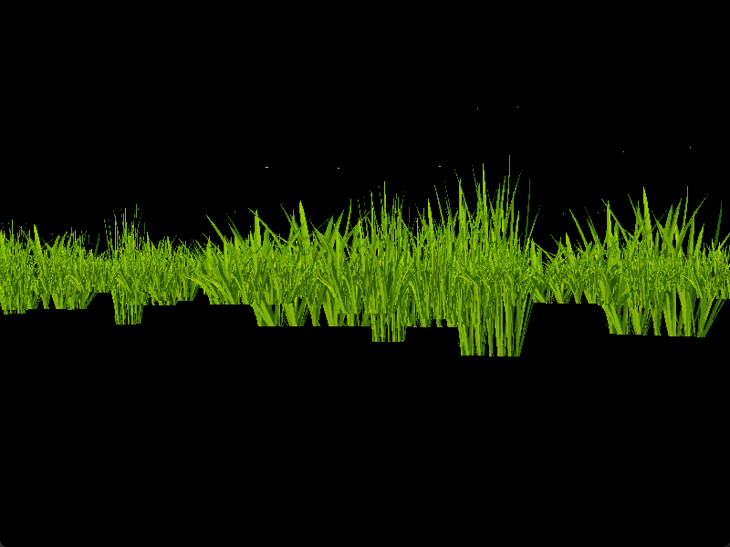
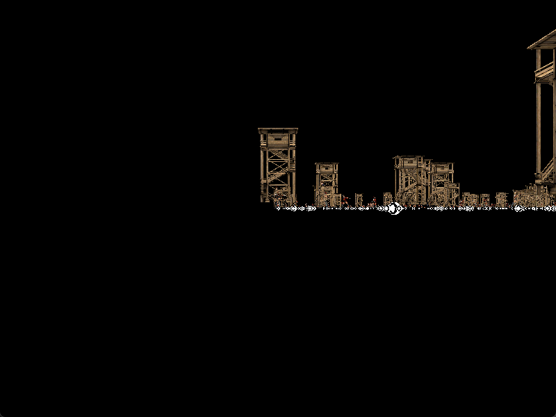
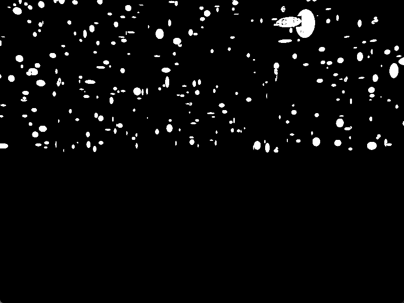

# DirectX 11 Study — 렌더링 파이프라인부터 엔진 구조까지 직접 따라 만들기


-5C2D91?logo=visualstudio&logoColor=white)


> **이 저장소는 인프런 DirectX 11 강의를 따라가며 작성한 학습용 코드입니다.**
> 상용 수준의 완성된 엔진이 아니라, **그래픽스 파이프라인과 게임 엔진 구조를 밑바닥부터 이해하기 위한 기록**입니다.
> 강의 범위를 넘어선 독자적인 시스템 설계나 성능 최적화 사례는 포함되어 있지 않습니다.


<sub>▲ `BillBoardDemo` — 카메라를 향해 회전하는 빌보드 수천 장으로 구성한 풀숲. 직접 빌드해 캡처한 화면입니다.</sub>

**[📝 학습 정리 블로그 32편](https://unialgames.tistory.com/category/DirectX)** · [🧱 엔진 구조](#-엔진-구조) · [🖼 실행 화면](#-실행-화면) · [🔧 빌드](#-빌드--실행)

---

## 📖 이 저장소가 증명하는 것

Unity·Unreal 같은 상용 엔진이 **내부에서 무엇을 하고 있는지**를 직접 만들어 보며 확인한 기록입니다.
정점 버퍼를 GPU에 올리고, 상수 버퍼로 행렬을 넘기고, 셰이더 패스를 골라 드로우콜을 부르는 과정을
엔진이 감춰 주지 않는 레벨에서 다뤘습니다.

구체적으로 다음을 직접 구현하며 확인했습니다.

- **렌더 파이프라인**: 정점/인덱스 버퍼 → 입력 레이아웃 → 상수 버퍼 → 셰이더 패스 → 드로우콜
- **엔진 아키텍처**: GameObject / Component 구조, 씬 그래프, 리소스 매니저, 렌더 매니저
- **조명·재질**: Ambient / Diffuse / Specular / Emissive, 노멀 매핑
- **모델·애니메이션**: Assimp 모델 임포트, 스키닝 애니메이션, 트위닝
- **최적화 기법**: 인스턴싱과 드로우콜, StructuredBuffer / RawBuffer / TextureBuffer
- **공간·충돌**: AABB · OBB · Sphere, Point Test / Intersection / Raycast

---

## 🧾 한눈에 보기

| 항목 | 내용 |
|---|---|
| **성격** | 강의 기반 학습 프로젝트 (포트폴리오상 **보조 프로젝트**) |
| **언어 / 표준** | C++20 |
| **그래픽 API** | Direct3D 11, Effects11(FX11) 셰이더 프레임워크 |
| **빌드 환경** | Visual Studio 2026 · MSVC v145 · Windows SDK 10.0 · Debug\|x64 |
| **솔루션** | 2개 / 프로젝트 5개 |
| **엔진 코드** | 소스 55개 · 헤더 59개 (서드파티 제외) |
| **데모** | 36개 (씬 기반으로 실행 가능한 것은 8개 — [알려진 한계](#-알려진-한계) 참고) |
| **셰이더** | `.fx` 33개 |
| **학습 기록** | [블로그 연재 32편](https://unialgames.tistory.com/category/DirectX) |

---

## 🗂 저장소 구조

```
DirectX/
├─ DirectX_Client/              # 메인 — 자체 DX11 엔진
│  ├─ Engine/                   #   정적 라이브러리 (55 cpp / 59 h)
│  ├─ Client/                   #   데모 36종 + 진입점
│  ├─ AssimpTool/               #   Assimp → 자체 포맷 변환 툴
│  ├─ Shaders/                  #   .fx 셰이더 33개
│  ├─ Resources/                #   모델 · 텍스처 · 애셋
│  └─ Libraries/                #   Assimp · DirectXTex · FX11
│
├─ DirectX_InflearnCode/        # 이전 세대 — 엔진 구조 학습 단계
│  ├─ DirectX_InflearnCode/     #   Chapter1: 초기화 · 삼각형 · 파이프라인
│  └─ ..._Chapter2/             #   Chapter2: 컴포넌트 구조 + 매니저 4종
│
└─ imgui-master/                # Dear ImGui (벤더링)
```

두 솔루션은 **같은 내용을 두 번 만든 기록**입니다.
`DirectX_InflearnCode`에서 컴포넌트 구조와 매니저를 먼저 익히고,
`DirectX_Client`에서 그 위에 렌더링 기법과 모델·애니메이션까지 확장했습니다.

---

## 🧱 엔진 구조

`Engine` 프로젝트는 정적 라이브러리로 빌드되어 `Client` / `AssimpTool` 이 링크합니다.

| 영역 | 구성 요소 |
|---|---|
| **코어 루프** | `Game` · `Graphics` · `Viewport` · `TimeManager` · `InputManager` · `IExecute` |
| **씬 · 오브젝트** | `Scene` · `SceneManager` · `GameObject` · `Transform` · `Component` · `MonoBehaviour` |
| **렌더링** | `Shader` · `Pass` · `Technique` (FX11) · `Material` · `Texture` · `Mesh` · `MeshRenderer` |
| **버퍼** | `VertexBuffer` · `IndexBuffer` · `ConstantBuffer` · `StructuredBuffer` · `RawBuffer` · `TextureBuffer` |
| **인스턴싱** | `InstancingManager` · `InstancingBuffer` |
| **지오메트리** | `Geometry` · `GeometryHelper` · `VertexData` · `Primitive3D` |
| **충돌** | `BaseCollider` · `AABBBoxCollider` · `OBBBoxCollider` · `SphereCollider` |
| **모델 · 애니메이션** | `Model` · `ModelMesh` · `ModelAnimation` · `ModelRenderer` · `ModelAnimator` |
| **연출** | `Light` · `Terrain` · `Billboard` · `SnowBillboard` · `Button` |
| **리소스 · 유틸** | `ResourceManager` · `ResourceBase` · `FileUtils` · `MathUtils` · `SimpleMath` · `tinyxml2` |
| **툴 연동** | `ImGUIManager` (Dear ImGui) |

`Component` 를 상속한 렌더러 컴포넌트의 `Update()` 안에서 상수 버퍼를 채우고 드로우콜까지 수행하는 구조입니다.
Unity의 컴포넌트 모델을 참고한 형태로, `GameObject::Update()` → 각 컴포넌트 `Update()` 순으로 흐릅니다.

### AssimpTool

FBX 등 외부 모델을 런타임에 파싱하지 않고 **자체 바이너리 포맷으로 미리 변환**하는 오프라인 툴입니다.
`Converter` 가 Assimp로 읽어 메시(`.mesh`) · 재질 · 애니메이션(`.clip`) 으로 나눠 저장합니다.

---

## 🖼 실행 화면

> 모두 이 저장소를 빌드해 **직접 실행하고 캡처한 화면**입니다. (Debug\|x64, 800×600)

| `SceneDemo` — 모델 인스턴싱 | `SnowDemo` — 눈 파티클 |
|---|---|
|  |  |
| 구조물·유닛을 인스턴싱으로 일괄 드로우 | 셰이더에서 시간 기반으로 낙하 위치 계산 |

| `OrthographicDemo` — 직교투영 UI | `CollisionDemo` — 씬 · 충돌 |
|---|---|
|  |  |
| 원근(구체)과 직교(UI 쿼드)를 한 화면에 | 콜라이더를 붙인 오브젝트를 씬에 배치 |

| `Chapter2` — 스프라이트 애니메이션 |
|---|
|  |
| 키프레임 4장을 0.1초 간격으로 순환 (이전 세대 솔루션) |

이 밖에 `ButtonDemo` · `ViewportDemo` · `TextureBufferDemo` 캡처가 [`docs/images/`](docs/images) 에 있습니다.

---

## 📚 학습 기록 — 블로그 연재 32편

구현하면서 이해한 내용을 [블로그](https://unialgames.tistory.com/category/DirectX)에 정리했습니다.
**코드보다 이 글들이 "무엇을 이해했는가"를 더 잘 보여줍니다.**

| 주제 | 다룬 내용 |
|---|---|
| **엔진 구조** | GameObject·Transform / Component·MonoBehaviour / SceneManager·MeshRenderer / ResourceManager / RenderManager / Animation System |
| **렌더링 기초** | 3D Mesh 렌더링 / Sampler / Normal / Depth Stencil / HeightMap 지형 생성 |
| **조명 · 재질** | Ambient · Diffuse · Specular · Emissive / Normal Mapping |
| **모델 · 애니메이션** | Model Import / Animation / Animation Tweening |
| **최적화 · 버퍼** | 인스턴싱과 드로우콜 / Mesh·Model·Animation Instancing / RawBuffer / TextureBuffer / StructuredBuffer |
| **공간 · 충돌** | AABB·OBB Collision / Sphere·AABB·OBB 도형 / Point Test / Intersection / Raycast / Triangle Raycast |
| **기타** | 스카이박스와 스카이돔 / Viewport / 직교투영과 UI / 빌보드와 파티클 |

---

## 🔧 빌드 & 실행

### 요구 사항

| 항목 | 버전 |
|---|---|
| Visual Studio | 2026 (MSVC **v145**) |
| Windows SDK | 10.0 (설치본 자동 선택) |
| 구성 | **Debug \| x64** — 동봉 라이브러리가 x64 전용이라 Win32는 링크되지 않습니다 |

### 절차

1. `DirectX/DirectX_Client/GameCoding.sln` 을 엽니다.
2. 솔루션 탐색기에서 **`Client` 우클릭 → 시작 프로젝트로 설정**
   `Engine` 은 정적 라이브러리라 F5로 실행할 수 없습니다.
3. 구성이 `Debug | x64` 인지 확인하고 F5.

실행할 데모는 [`Client/Main.cpp`](DirectX/DirectX_Client/Client/Main.cpp) 에서 바꿉니다.

```cpp
desc.app = make_shared<SnowDemo>();   // ← 이 줄의 데모 클래스를 교체
```

리소스는 `..\Shaders\`, `..\Resources\` 같은 **상위 상대 경로**로 참조하므로,
작업 디렉터리가 `Client\` 또는 `Binaries\` 여야 합니다. (VS 기본값인 `$(ProjectDir)` 로 동작)

`DirectX/DirectX_InflearnCode/DirectX_InflearnCode.sln` 도 같은 방식으로 빌드됩니다.

---

## 🛠 빌드 환경 이전 기록

VS2022(v143) 기준으로 작성된 코드를 VS2026(v145)에서 다시 빌드·실행할 수 있게 정리한 내역입니다.
과정에서 기존에 묻혀 있던 컴파일·링크·런타임 문제도 함께 드러나 수정했습니다.

| 증상 | 원인 | 조치 |
|---|---|---|
| `MSB8020` 툴셋 없음 | VS2026에는 v143이 없음 (프로젝트 5개가 v143/v142 지정) | `PlatformToolset` 을 v145로 통일 |
| 병렬 빌드 시 `LNK1104` | `Engine.lib` 을 `#pragma comment(lib)` 로만 참조해 MSBuild가 빌드 순서를 모름 | `Client`·`AssimpTool` 에 Engine 프로젝트 참조 추가 (순서 보장 전용) |
| `C2039 'Add'` | `SnowBillboard.cpp` 에 정의만 있고 헤더 선언 누락 | 헤더에 선언 추가 |
| `LNK2019` 5건 | Chapter2 `Animation`·`Animator` 의 선언만 있고 구현 없음 | `SetLoop`·`IsLoop`·`SetTexture`·`GetTexture`·`SetAnimation` 구현 |
| Chapter2 화면 정지 | 진입점이 블로킹 `GetMessage` 루프라 입력이 없으면 `Update()` 미호출 | Chapter1과 동일한 `PeekMessage` 논블로킹 루프로 변경 |
| 클린 클론 시 빌드 무한 대기 | PreBuildEvent의 `xcopy` 가 대상 폴더 부재 시 F/D 프롬프트로 대기 | `mkdir` 보장 + `xcopy /I` 추가 |
| 빌드 산출물이 전부 추적됨 | 무시 규칙 파일명이 `C++.gitignore` 라 git이 읽지 않음 | `.gitignore` 신설, 산출물 414개 추적 해제 |

---

## ⚠️ 알려진 한계

정직하게 남겨 둡니다. 학습 진행 중 구조를 갈아엎으면서 생긴 흔적들입니다.

- **데모 36개 중 실제로 렌더링되는 것은 8개**입니다.
  `BillBoard` · `Button` · `Collision` · `Orthographic` · `Scene` · `Snow` · `TextureBuffer` · `Viewport` 만
  씬(`CUR_SCENE`) 기반으로 작성됐습니다. 나머지 28개는 구형 `RENDER->` 매니저 방식으로 작성됐는데
  해당 호출이 주석 처리되어 있어 창은 뜨지만 화면이 비어 있습니다.
- **모델 렌더링은 인스턴싱 경로로만 동작합니다.**
  `InstancingManager::Render()` → 각 렌더러의 `RenderInstancing()` 경로는 살아 있어서
  씬 기반 데모(`SceneDemo` 등)에서는 모델이 정상적으로 그려집니다.
  반면 **오브젝트 개별 렌더 경로는 비활성**입니다 —
  `ModelRenderer::Update()` 는 헤더에서 주석 처리(`//virtual void Update() override;`)되어 있고,
  `ModelAnimator` 에는 `Update()` 자체가 없습니다(주석 처리된 버전만 2개 남아 있음).
  그래서 씬에 등록하지 않고 `_obj->Update()` 를 직접 부르는 `AssimpTool` 의 `AnimationDemo` 는
  모델 로딩까지는 성공하지만 화면이 비어 있습니다.
- **`Animation::Save` 가 텍스처 경로를 저장하지 않습니다** (`TexturePath = "TODO"`).
  저장 후 로드하면 텍스처가 `nullptr` 이 됩니다.
- **Release 구성은 검증하지 않았습니다.** Debug\|x64 만 빌드·실행을 확인했습니다.
- **`.git` 히스토리에 과거 빌드 산출물이 남아 있어 약 236MB입니다.**
  추적은 해제했지만 히스토리 재작성은 하지 않았습니다.
- 성능 측정(프레임 타임 · 드로우콜 · 메모리) 자료는 **없습니다.** 측정한 적이 없습니다.

---

## 🔗 링크

- **학습 정리 블로그**: <https://unialgames.tistory.com/category/DirectX>

---

<sub>학습 출처: 인프런 DirectX 11 강의. 이 저장소의 코드는 강의를 따라가며 작성한 것으로, 독자적인 설계 기여는 포함되어 있지 않습니다.</sub>
